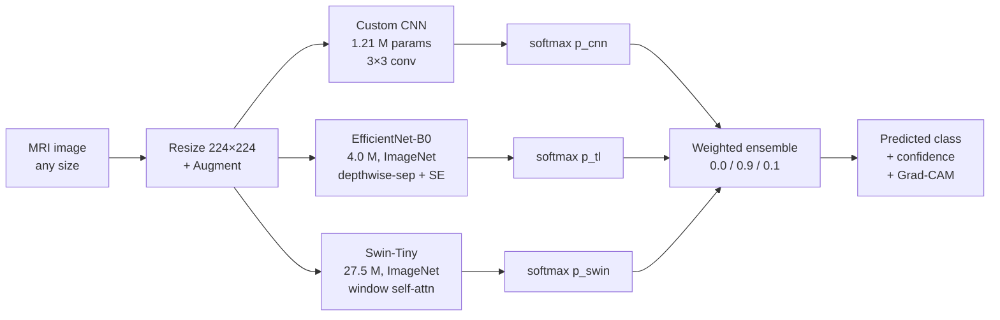

# 🧠 Brain Tumor Detection — CNN + Transfer Learning + Swin Transformer Ensemble

A complete deep-learning system that classifies brain MRI scans into
**glioma**, **meningioma**, **pituitary**, or **no tumor** using a
three-model ensemble of architecturally diverse networks. Includes
training pipelines, evaluation, explainability (Grad-CAM), a Streamlit
UI, a FastAPI backend, ONNX exports, and a Dockerfile.


---

## Headline Results

> **Best test-set accuracy: 94.94 %** on 1,600 held-out MRI images,
> with **macro ROC-AUC = 0.991**.

| Model | Params | Val acc | **Test acc** | Macro AUC | Train (min) | Latency ms/img |
|---|---:|---:|---:|---:|---:|---:|
| Custom CNN | 1.21 M | 0.904 | 0.828 | 0.951 | 32.1 | 6.8 |
| EfficientNet-B0 (TL) | 4.01 M | 0.989 | **0.949** | **0.991** | 14.9 | 24.1 |
| Swin-Tiny | 27.52 M | 0.967 | 0.919 | 0.986 | 12.5 | 25.7 |
| **Ensemble** (weighted) | 32.74 M | 0.989 | 0.947 | 0.991 | 59.5 | 56.6 |


---

## What's inside



Three architecturally diverse models (vanilla CNN, depthwise-separable
CNN with squeeze-excite, hierarchical transformer) produce probability
distributions that are combined via a weighted average whose weights
were tuned on a held-out validation set.

---

## Quickstart (Windows)

```powershell
# 1. Clone, then create the venv + install everything
cd "C:\Brain Tumor Detection"
.\setup.ps1                                 # or: .\setup.ps1 -CPU for no-GPU machines

# 2. Place the Brain Tumor MRI Dataset at DATASET/
#    DATASET/Training/{glioma,meningioma,notumor,pituitary}/
#    DATASET/Testing/{glioma,meningioma,notumor,pituitary}/

# 3. Verify everything
python -m src.check_env

# 4. Reproduce the training (optional, ~1 hour total on a GTX 1650)
jupyter nbconvert --to notebook --execute --inplace notebooks/02_CNN_Training.ipynb
jupyter nbconvert --to notebook --execute --inplace notebooks/03_TransferLearning.ipynb
jupyter nbconvert --to notebook --execute --inplace notebooks/04_SwinTransformer.ipynb
jupyter nbconvert --to notebook --execute --inplace notebooks/05_Ensemble_Model.ipynb
jupyter nbconvert --to notebook --execute --inplace notebooks/06_Test_Evaluation.ipynb
jupyter nbconvert --to notebook --execute --inplace notebooks/07_Explainability.ipynb

# 5. Run the Streamlit UI
streamlit run app/app.py
# open http://localhost:8501
```

---

## Project layout

```
.
├── DATASET/                         # raw MRI images (Training/, Testing/)
├── data/processed/                  # cached stratified split CSVs
│
├── notebooks/                       # narrative + reproducible runs
│   ├── 01_EDA.ipynb
│   ├── 02_CNN_Training.ipynb
│   ├── 03_TransferLearning.ipynb
│   ├── 04_SwinTransformer.ipynb
│   ├── 05_Ensemble_Model.ipynb
│   ├── 06_Test_Evaluation.ipynb
│   └── 07_Explainability.ipynb
│
├── src/                             # production package
│   ├── config.py                    # central paths + hyperparameters
│   ├── data_loader.py               # Dataset + DataLoader factory + stratified split
│   ├── preprocess.py                # transforms (train/val/test/inference)
│   ├── cnn_model.py                 # BrainTumorCNN
│   ├── transfer_model.py            # TransferModel (5 backbones)
│   ├── swin_model.py                # SwinModel (timm-backed)
│   ├── ensemble.py                  # soft voting / weighted / stacking
│   ├── train.py                     # reusable AMP + early-stop + TB engine
│   ├── evaluate.py                  # metrics, CM, ROC, benchmarks
│   ├── explainability.py            # Grad-CAM for all 3 models
│   ├── inference.py                 # BrainTumorPredictor (production API)
│   ├── export.py                    # ONNX export + verify
│   └── utils.py                     # seed, device, param counts
│
├── app/
│   ├── app.py                       # Streamlit UI
│   └── api.py                       # FastAPI REST backend
│
├── models/                          # trained weights + ensemble config
│   ├── cnn_model.pth
│   ├── transfer_model.pth
│   ├── swin_model.pth
│   ├── *.onnx                       # ONNX exports
│   └── ensemble_config.json
│
├── outputs/                         # plots, confusion matrices, reports
│   ├── plots/*.png
│   ├── confusion_matrices/*.png
│   ├── gradcam/*.png
│   └── reports/*.{csv,json}
│
├── docs/                            # extended documentation
│   ├── VIVA_QA.md
│   ├── INTERVIEW_QA.md
│   └── architecture.md
│
├── logs/                            # TensorBoard event files
│
├── Dockerfile
├── requirements.txt
├── setup.ps1
├── README.md                        # this file
└── REPORT.md                        # research-paper style write-up
```

---

## Deployment

Four interchangeable interfaces all wrap the same trained checkpoints:

### Streamlit UI (single-user, demo)

```powershell
streamlit run app/app.py
# http://localhost:8501
```

### FastAPI REST (multi-user, programmatic)

```powershell
uvicorn app.api:app --host 0.0.0.0 --port 8000
# http://localhost:8000/docs   <- Swagger UI
# curl -F "file=@brain.jpg" http://localhost:8000/predict
```

### ONNX Runtime (no-PyTorch, cross-platform)

```powershell
python -m src.export    # writes models/{cnn,transfer,swin}_model.onnx
# Verified 100% argmax agreement with PyTorch, 2-3.5x CPU speedup
```

### Docker (containerized)

```powershell
docker build -t brain-tumor:1.0 .
docker run --rm -p 8501:8501 brain-tumor:1.0          # Streamlit
docker run --rm -p 8000:8000 brain-tumor:1.0 \
    uvicorn app.api:app --host 0.0.0.0 --port 8000    # FastAPI
```

---

## Dataset

[Brain Tumor MRI Dataset](https://www.kaggle.com/datasets/masoudnickparvar/brain-tumor-mri-dataset)
(Masoud Nickparvar, Kaggle):

| Split | Class | Images |
|---|---|---:|
| Training | glioma | 1,321 → **1,120** train + **280** val (stratified 80/20) |
| Training | meningioma | 1,339 → 1,120 train + 280 val |
| Training | notumor | 1,595 → 1,120 train + 280 val |
| Training | pituitary | 1,457 → 1,120 train + 280 val |
| Testing | each class | **400** (held-out, untouched until STEP 15) |

(The reproduced dataset in this repo balances each Training class to 1,400.)

---

## Hardware

- Tested on: NVIDIA GTX 1650 (4 GB VRAM), Windows 10, Python 3.11.0
- Falls back gracefully to CPU (~6× slower training, inference still real-time)

---

## Documentation

- **[REPORT.md](REPORT.md)** — research-paper-style write-up
- **[docs/VIVA_QA.md](docs/VIVA_QA.md)** — anticipated examiner questions & answers
- **[docs/INTERVIEW_QA.md](docs/INTERVIEW_QA.md)** — DL interview prep grounded in this project
- **[docs/architecture.md](docs/architecture.md)** — detailed architecture per model

## Acknowledgments

- Dataset: [Brain Tumor MRI Dataset](https://www.kaggle.com/datasets/masoudnickparvar/brain-tumor-mri-dataset) by Masoud Nickparvar.
- Pretrained backbones: torchvision (EfficientNet-B0), `timm` (Swin-Tiny).
- Grad-CAM: [pytorch-grad-cam](https://github.com/jacobgil/pytorch-grad-cam) by Jacob Gildenblat.

## License

Academic / educational use only. **NOT a medical device** and **NOT a substitute for a radiologist's diagnosis.** Datasets retain their original licenses.
