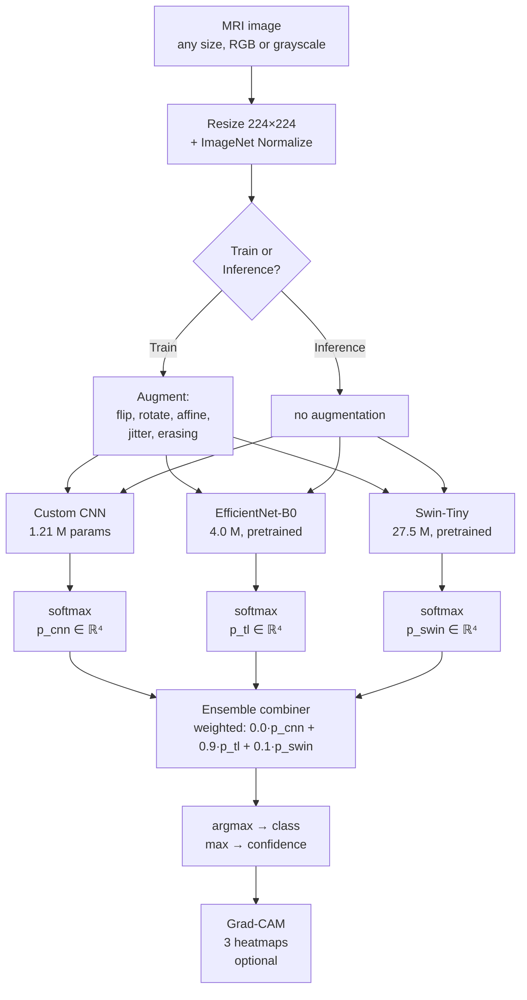
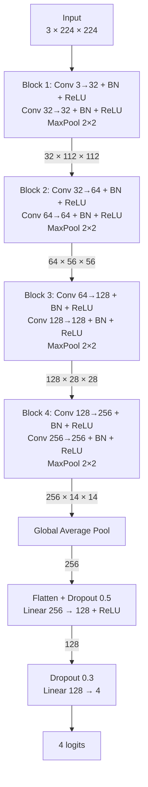
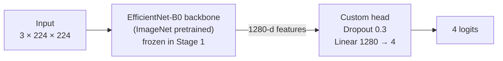
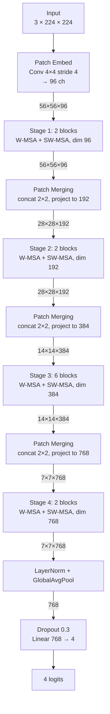
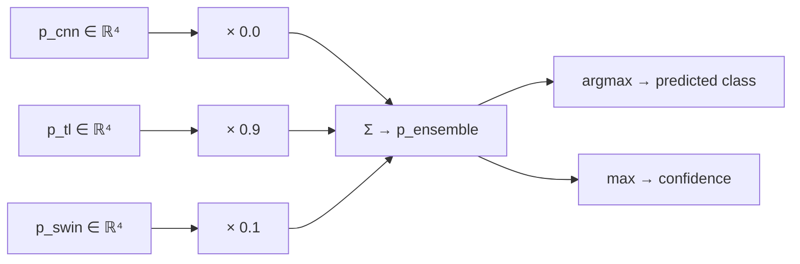
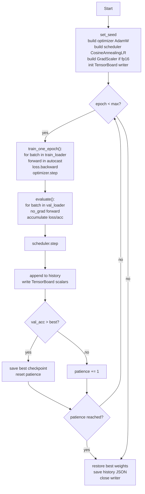
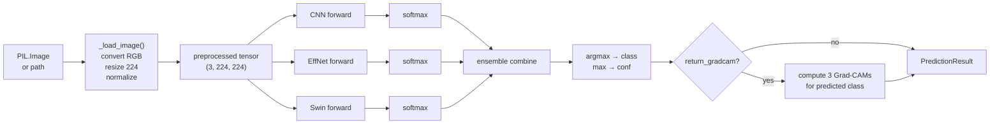
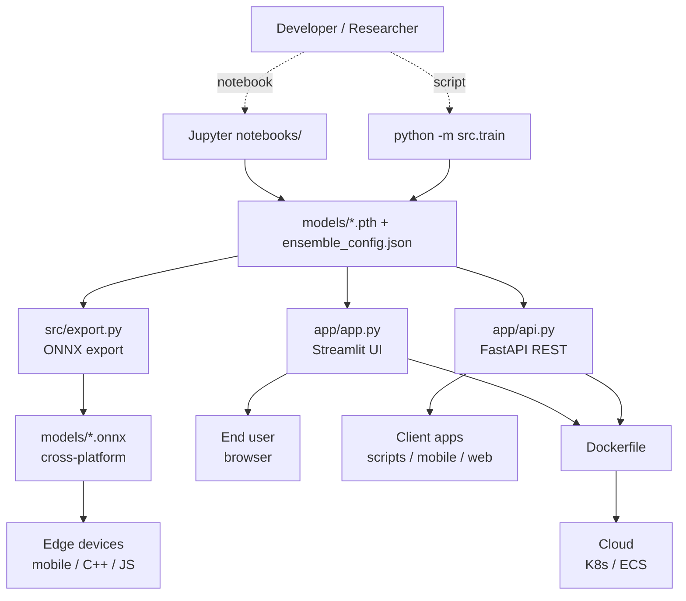

# Architecture Reference

Detailed per-model architecture descriptions and a system-level
diagram. All diagrams use mermaid (renders inline on GitHub/GitLab)
and can be exported to PNG via the mermaid CLI if you need them for
LaTeX or slides.

---

## 1. System-level pipeline

---

## 2. Custom CNN (`src/cnn_model.py`)

| Stat | Value |
|---|---|
| Total parameters | 1,206,628 |
| Conv2d parameters | 1,171,296 (97 %) |
| BatchNorm parameters | 1,920 |
| Linear parameters | 33,412 (3 %) |
| Receptive field at last conv | ~100 × 100 pixels |
| Weight initialization | Kaiming normal (mode=fan_out, ReLU) |

---

## 3. Transfer model (`src/transfer_model.py`)

| Stat | Value |
|---|---|
| Backbone | `torchvision.models.efficientnet_b0` |
| Backbone params | 4,007,548 |
| Head params | 5,124 (1280 × 4 + 4) |
| Total params | 4,012,672 |
| Stage 1: trainable | 5,124 (head only) |
| Stage 2: trainable | 4,012,672 (everything) |
| Stage 1 LR | 1e-3 (4 epochs) |
| Stage 2 LR | 1e-4 (8 epochs, 10× smaller) |

### Why two-stage?

1. Random head → noisy gradients → would corrupt the pretrained
   backbone if not frozen.
2. After 3-4 epochs, the head produces sensible logits; gradients
   flowing back are informative.
3. Stage 2 unfreezes the backbone with a 10× smaller LR to *adjust*
   the pretrained features without overwriting them.

---

## 4. Swin Transformer (`src/swin_model.py`)

| Stat | Value |
|---|---|
| Backbone | `timm.create_model('swin_tiny_patch4_window7_224')` |
| Patch size | 4 × 4 |
| Window size | 7 × 7 |
| Stage depths | [2, 2, 6, 2] |
| Heads per stage | [3, 6, 12, 24] |
| Total params | 27,522,430 |
| Head params | 3,076 (768 × 4 + 4) |
| Stage 1 LR | 1e-3 (3 epochs, head only) |
| Stage 2 LR | **2e-5** (4 epochs, 50× smaller — critical for transformers) |

### The shifted-window mechanism

Without shifted windows, tokens in different 7 × 7 windows can never
attend to each other. Swin alternates: layer 2L uses regular windows,
layer 2L+1 shifts by (3, 3) — so windows in the shifted layout
overlap the regular ones. After both layers, every token has
influenced every neighbour across the original window boundary.

---

## 5. Ensemble (`src/ensemble.py`)

Weights `(0.0, 0.9, 0.1)` were found by **exhaustive grid search**
over the simplex `{(w_cnn, w_tl, w_swin) : w_i ≥ 0, Σw = 1}` at
step 0.05 (231 candidates for M=3), optimizing validation accuracy.

The grid search effectively *discarded* the custom CNN (`w_cnn = 0`)
because its predictions overlap too much with EfficientNet's — adding
it brings no complementary signal but does add noise.

---

## 6. Training engine (`src/train.py`)

---

## 7. Inference path (`src/inference.py`)

`BrainTumorPredictor` loads all 3 models once (cached by Streamlit /
FastAPI). Per-image inference: ~85-100 ms without Grad-CAM,
~250-950 ms with Grad-CAM (first call has CUDA kernel warmup).

---

## 8. Deployment topology

All paths share the same trained checkpoints — change a model once,
and every deployment channel picks it up.
